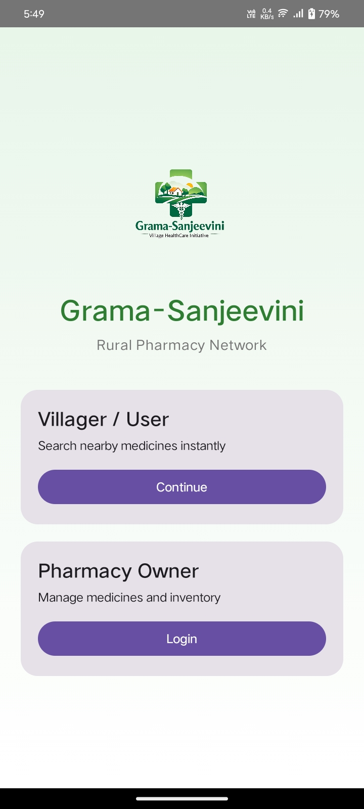
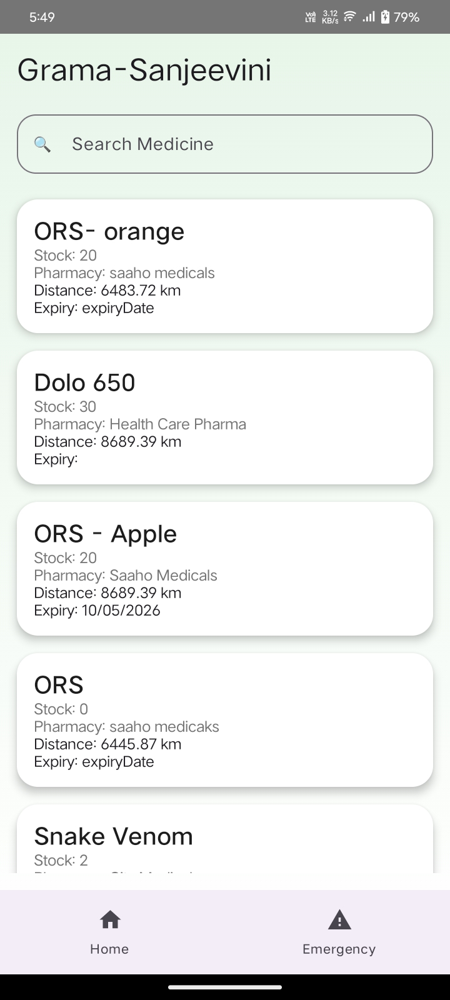
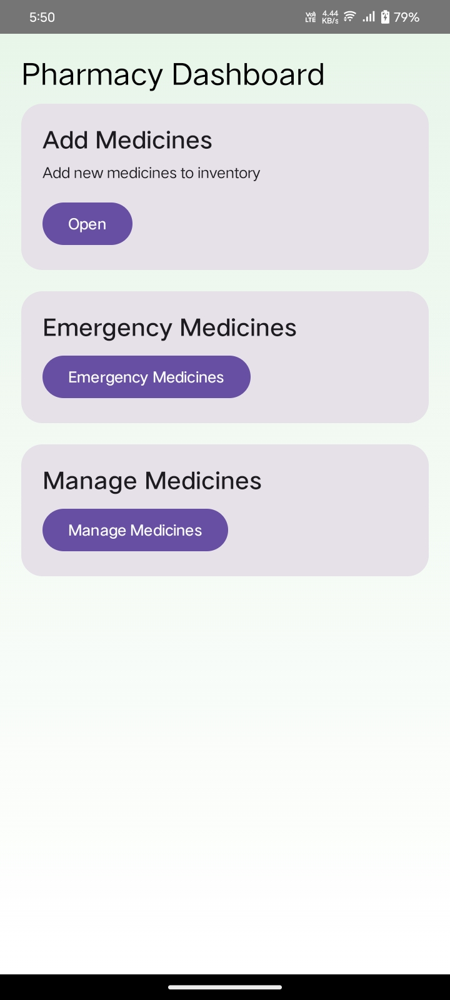
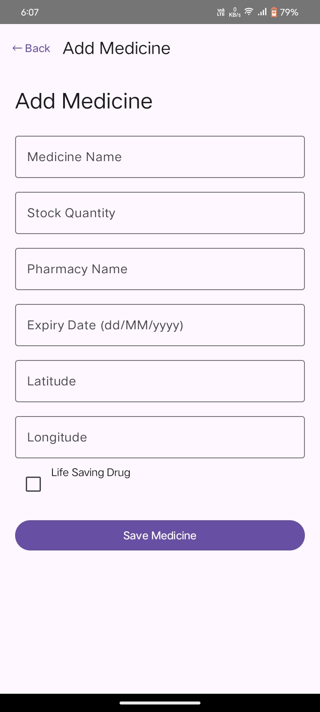
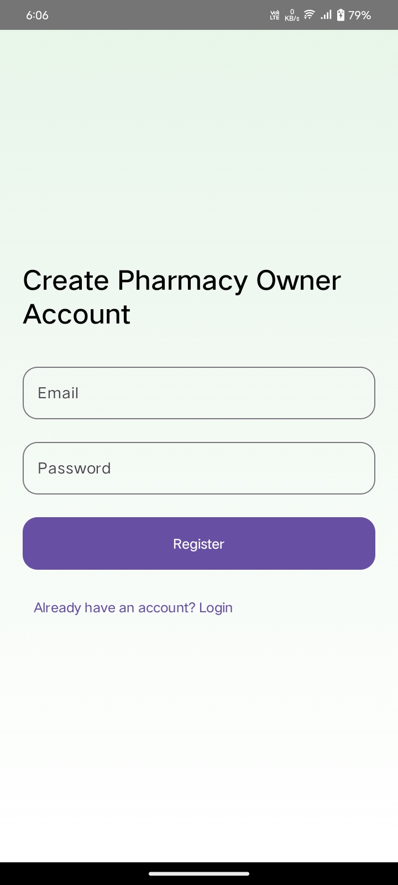
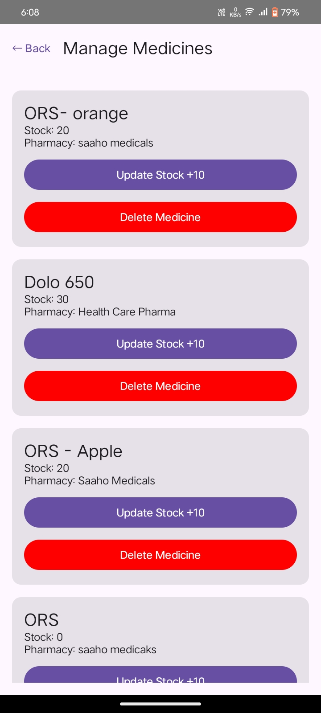
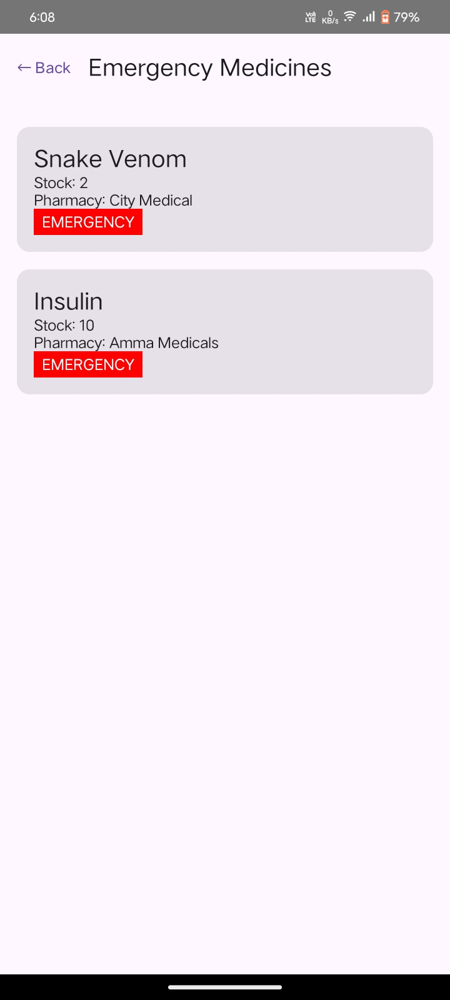

# Grama-Sanjeevini 🏥

Grama-Sanjeevini is a role-based Android healthcare application developed using Kotlin, Jetpack Compose, Firebase Authentication, and Firebase Firestore. The application helps villagers search medicines across nearby pharmacies and allows pharmacy owners to manage medicine inventory in real time.

The project focuses on improving rural healthcare accessibility by connecting multiple village pharmacies into a shared medicine availability network.

---

# 🚀 Features

## 👨‍🌾 User Features

* Search medicines instantly across nearby pharmacies
* View emergency/life-saving medicines
* Real-time medicine availability updates
* Nearby pharmacy distance tracking using GPS
* Modern and user-friendly healthcare UI

## 🏪 Pharmacy Owner Features

* Pharmacy owner registration using Firebase Authentication
* Secure owner registration and login using Firebase Authentication
* Add medicines to inventory
* Update medicine stock
* Delete medicines
* Expiry date tracking and alerts
* Emergency medicine tagging

---

# 🛠️ Tech Stack

* Kotlin
* Jetpack Compose
* Firebase Authentication
* Firebase Firestore
* Google Location Services API
* Material 3
* Android Studio
* MVVM Architecture

---

# 📱 Screens Included

* Role Selection Screen
* User Home Screen
* Pharmacy Owner Registration Screen
* Pharmacy Owner Login Screen
* Pharmacy Dashboard
* Add Medicine Screen
* Manage Medicines Screen
* Emergency Medicines Screen

---

# 🔥 Firebase Features Used

* Firebase Authentication
* Firebase Firestore Database
* Real-time Firestore Updates

---

# 📍 GPS & Location Features

The application uses Google Location Services API to fetch the user's live GPS location and calculate the nearby pharmacy distance dynamically.

Example:

```plaintext
Amma Medicals — 2.4 km away
```

---

# 🎯 Problem Statement

In rural villages, people often travel long distances searching for medicines because nearby pharmacy availability is unknown.

Grama-Sanjeevini solves this problem by:

* Connecting multiple pharmacies into one network
* Helping villagers search medicines instantly
* Showing nearby pharmacy locations
* Reducing medicine wastage using expiry alerts
* Improving emergency medicine accessibility

---

# 🧩 Project Structure

```plaintext
app/
 ┣ model/
 ┣ navigation/
 ┣ ui/screens/
 ┣ ui/theme/
 ┗ MainActivity.kt
```

---

# ⚙️ Installation & Setup

## 1. Clone Repository

```bash
git clone https://github.com/Santhosh-S17/Grama-Sanjeevini.git
```

## 2. Open Project

Open the project in Android Studio.

## 3. Sync Gradle

Allow Gradle dependencies to download and sync.

## 4. Connect Firebase

* Create Firebase project
* Add Android app
* Download `google-services.json`
* Place file inside:

```plaintext
app/google-services.json
```

## 5. Run Application

Connect an Android device or emulator and run the project.

---

# ▶️ Run Command

Run the application directly from Android Studio using:

```plaintext
Shift + F10
```

---

# 📸 Screenshots

<h3>Role Selection</h3>
)
<h3>Home Screen</h3>
)
<h3>Owner Dashboard</h3>
)
<h3>Add Medicine</h3>
)
<h3>Owner Register</h3>
)
<h3>Manage Medicine</h3>
)
<h3>Emergency Medicines Screen</h3>



---

# 🔄 CRUD Operations

The project supports full CRUD operations using Firebase Firestore.

* Create Medicines
* Read Medicines
* Update Medicine Stock
* Delete Medicines


# 🔐 Authentication Flow

Role Selection
↓
Owner Register
↓
Owner Login
↓
Owner Dashboard

Firebase Authentication is used for secure owner registration and login.


# 🌟 Key Highlights

* Real-time Firebase synchronization
* Role-based authentication system
* GPS-based nearby pharmacy detection
* Emergency medicine identification
* Expiry alert system
* Modern Material 3 UI
* Cloud-based healthcare inventory system

---

# 👨‍💻 Developed By

Santhosh S

---


# 📄 License

This project is developed for educational and internship purposes.
